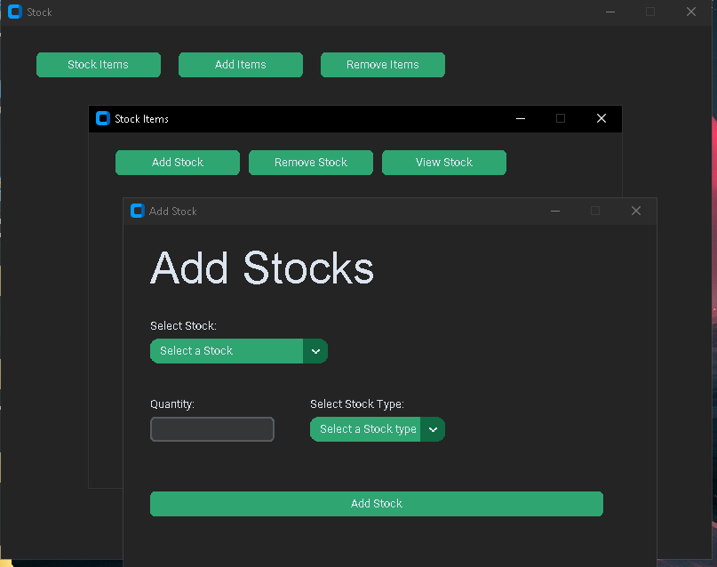

# Stock Management System

## Overview
The Stock Management System is a desktop application built using Python and the CustomTkinter library. It allows users to manage stock items, including adding, removing, and viewing stock details. The application also provides functionalities to export stock data to Excel files for further analysis.




## Features
- **Add Stock**: Users can add new stock items along with their quantities and types.
- **Remove Stock**: Users can remove stock items and specify reasons for removal.
- **View Stock**: Users can view current stock levels and historical data.
- **Export to Excel**: Users can export stock data to Excel files for reporting and analysis.

## Technologies Used
- Python
- CustomTkinter
- Tkinter
- Pandas
- CSV
- JSON

## Installation
1. Clone the repository:
   ```bash
   git clone https://github.com/yourusername/stock-management-system.git
   ```
2. Navigate to the project directory:
   ```bash
   cd stock-management-system
   ```
3. Install the required packages:
   ```bash
   pip install customtkinter pandas
   ```

## Usage
1. Run the application:
   ```bash
   python main.py
   ```
2. Use the GUI to manage stock items:
   - Click on "Stock Items" to manage stock.
   - Click on "Add Items" to add new items to the inventory.
   - Click on "Remove Items" to remove items from the inventory.

## Codebase Structure
The main functionality of the application is implemented in `main.py`, which includes:
- **Stock Management Functions**: Functions to add, remove, and view stock items.
- **Data Handling**: Reading and writing stock data to JSON and CSV files.
- **User Interface**: GUI components for user interaction using CustomTkinter.

### Key Functions
- `add_stock_window()`: Opens a window to add new stock items.
- `remove_stock_window()`: Opens a window to remove existing stock items.
- `view_stock_window()`: Displays current stock levels and allows for exporting data.
- `remove_item_window()`: Allows users to remove items from the inventory.

## File Structure
```
/data
    /Stock_data
        totalstock_data.csv
        addedstock_data.csv
        removedstock_data.csv
        all_data.csv
```

## Contributing
Contributions are welcome! Please open an issue or submit a pull request for any enhancements or bug fixes.

## Credits
- Created By Nafees
- Portfolio: https://nafeesansari.vercel.app
- Discord: nafees.is.here 

## Acknowledgments
- Thanks to the contributors and the open-source community for their support.
